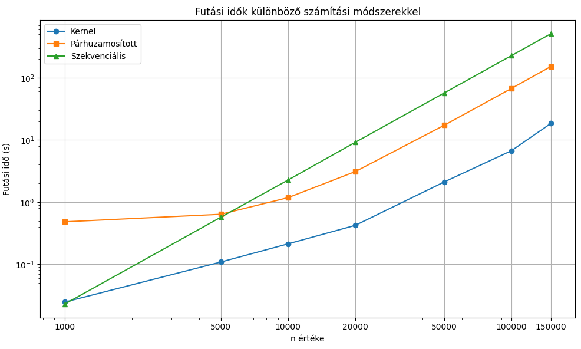

# Név: Nagy Máté

## Neptun: U3ROFS

## Téma: Maclaurin series

## Programozási nyelv: Python

### Leírás:

A projekt célja a **sin(x)** függvény közelítésének sebességének növelése volt a Maclaurin-sor használatával, kihasználva a párhuzamosítás előnyeit. Három különböző megközelítést vizsgáltunk meg a közelítés gyorsaságának fokozása érdekében, az alábbiak szerint:

Az egyes megközelítések teljesítményét különböző n értékek mellett vizsgáltuk meg, ahol n a Maclaurin-sor tagjainak számát jelöli. A vizsgálatok célja az volt, hogy bemutassuk, hogyan javítható a sin(x) függvény közelítésének sebessége a számítási munka megfelelő elosztásával.

- **Szekvenciális megközelítés**: Ebben az esetben a Maclaurin-sor összes tagjának kiszámítását egyetlen számítási szálon hajtottuk végre, egymás után. Ez a hagyományos, lineáris módszer szolgál alapként a többi megközelítés teljesítményének összehasonlításához.

- **Párhuzamosítás több szálon**: A második megközelítésben a Maclaurin-sor kiszámítását több szálon végeztük el, kihasználva a modern többmagos processzorok képességeit. Ezáltal a különböző sorozat tagok számítása egyszerre történhetett, jelentősen csökkentve a teljes kiszámítási időt.

- **Párhuzamosítás intervallumokra felosztással és számítás OpenCL kernelen**: A harmadik módszer tovább finomítja a párhuzamosítást azáltal, hogy az összegzést végző műveleteket intervallumokra osztja, és ezeket az intervallumokat egyidejűleg számítja ki az OpenCL kernelek segítségével. Ez a megközelítés kihasználja a grafikus processzorok (GPU-k) párhuzamosítási képességeit, ami lehetővé teszi a rendkívül nagy számítási teljesítmény elérését.

## Eredmények:

<table>
    <tr>
        <th>N</th>
        <th>Kernel (s)</th>
        <th>Párhuzamos (s)</th>
        <th>Szekvenciális (s)</th>
    </tr>
    <tr>
        <td>1000</td>
        <td>0.0246</td>
        <td>0.4821</td>
        <td>0.0228</td>
    </tr>
    <tr>
        <td>5000</td>
        <td>0.1085</td>
        <td>0.6375</td>
        <td>0.5711</td>
    </tr>
    <tr>
        <td>10000</td>
        <td>0.2130</td>
        <td>1.1805</td>
        <td>2.2670</td>
    </tr>
    <tr>
        <td>20000</td>
        <td>0.4229</td>
        <td>3.0998</td>
        <td>9.1867</td>
    </tr>
    <tr>
        <td>50000</td>
        <td>2.1115</td>
        <td>17.2688</td>
        <td>57.1633</td>
    </tr>
    <tr>
        <td>100000</td>
        <td>6.7256</td>
        <td>67.6507</td>
        <td>228.4678</td>
    </tr>
    <tr>
        <td>150000</td>
        <td>18.4596</td>
        <td>152.2810</td>
        <td>513.1467</td>
    </tr>
</table>
